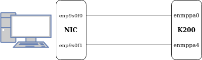
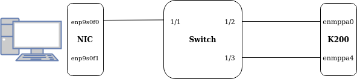

Run an Acceptance
=================

This page describes the different steps to take in order to perform the ethernet acceptance.

Network Setup
-------------
Prior to running the acceptance script, the network must be set up. All cables must be plugged in.
It is not necessary to configure autoneg settings and the IP addresses on the network interfaces, this will 
be configured automatically by the acceptance script.

Switch
~~~~~~
If your setup is composed of a switch, there is no need to configure the link between the switch and 
the workstation. 

For information: to configure autoneg settings on the switch, run the following commands to set autoneg to ON:

workstation: :command:`ethtool -s <itf> autoneg on`

Mellanox switch:

.. code-block:: bash

  enable
  configure terminal
  interface ethernet 1/<port>
  shutdown
  no speed
  no shutdown

Cisco switch:

.. code-block:: bash

  configure terminal
  interface ethernet 1/<port>
  shutdown
  speed auto
  negociate auto
  no shutdown

Replace :command:`<itf>` by the name of the ethernet interface and :command:`<port>` by the port number of the switch.

Interfaces binding
~~~~~~~~~~~~~~~~~~
In order to find which ethernet interfaces are binded between the workstation and the k200, run the command 
:command:`ethtool -m <itf>` on the workstation and compare the serial number of the cables.

Usage
------
Various arguments can be given to the acceptance script after the command `pytest`. A description of the arguments can 
be obtained by running :command:`pytest --help`. The most used arguments are the following:

.. code-block:: bash

  --serial=SERIAL       Path to MPPA TTY
  --vmlinux=VMLINUX     Path to vmlinux
  --iterations=ITERATIONS
                        Number of repetition of each test
  --report-path=REPORT_PATH
                        Path where to store test results and logs
  --report-template={oldschool,modern}
                        Template for the HTML report
  --config=CONFIG       Path to the configuration file config.yml
  --enmppa0=host_to_enmppa0
                        If set, test enmppa0. Argument must specify the devname of the interface from host to enmppa0
  --enmppa4=host_to_enmppa4
                        If set, test enmppa4. Argument must specify the devname of the interface from host to enmppa4
  --enmppa0-port=ENMPPA0_PORT
                        Port number of the switch connected to enmppa0. E.g: 1/12
  --enmppa4-port=ENMPPA4_PORT
                        Port number of the switch connected to enmppa4. E.g: 1/12
  --skip-itf-search     Skip the initial search of cable and interface bindings.
  --jtag-stm=JTAG_STM   Set JTAG connection
  --kvx-net-traces      Enable kvx net traces
  --email               Generate email containing results (continuous integration)
  --switch-vendor={mellanox-3.6,mellanox-3.9,cisco-9.3}
                        Test using a switch as link partner, supported vendors are mellanox and cisco
  --release=RELEASE     Linux release. e.g. 4.6
  --rtm-eom             Always generate the eye diagram no matter whether the test case passes or fails.
  --remote-host=REMOTE_HOST
                        SSH credentials in the form <user>@<host>:<password> if the host is remote
  --debug-mode          Start in Debug mode. Linux is assumed to be already running on MPPA.
  --no-interaction      Skip all tests that need user interaction.
  --loopback            Start in lookback mode.

Configuration file
------------------
The most important arguments can be passed to the acceptance script using a configuration file. The format of this 
file is Yaml, an example can be found here: `linux_valid/ethernet_pytest/default_config.yml`. The content is shown below:

.. code-block:: bash

  version: 0.1
  vmlinux: /path/to/vmlinux
  acceptance-db: /path/to/acceptance.db
  iterations: 1
  release: 4.7
  switch-mgmt:
    - vendor: mellanox-3.6
      hostname: kalray-22
      port: 22
      login: admin
      password: password_to_change
    - vendor: mellanox-3.9
      hostname: kalray-30
      port: 22
      login: hudson
      password: password_to_change
    - vendor: cisco-9.3
      hostname: kalray-32
      port: 22
      login: admin
      password: password_to_change
  test-parameters:
    - autoneg: 'on'
      speed:
        host: 100000
        mppa: 100000
      fec: auto
    - autoneg: 'off'
      speed:
        host: 40000
        mppa: 40000
      fec: 'rs'
    - autoneg: 'off'
      speed:
        host: 40000
        mppa: 40000
      fec: 'baser'
    - autoneg: 'off'
      speed:
        host: 100000
        mppa: 100000
      fec: 'rs'
    - autoneg: 'off'
      speed:
        host: 100000
        mppa: 100000
      fec: 'baser'
  ip-bindings:
    - enmppa0:
      host: 192.168.253.10/24
      mppa: 192.168.253.1/24
    - enmppa4:
      host: 192.168.244.10/24
      mppa: 192.168.244.1/24

+------------------+-----------------------------------------------------------------------------------------------+
| Item             | Description                                                                                   |
+==================+===============================================================================================+
| version          | version of the configuration file. Do not change it.                                          |
+------------------+-----------------------------------------------------------------------------------------------+
| vmlinux          | Path to the vmlinux binary.                                                                   |
+------------------+-----------------------------------------------------------------------------------------------+
| acceptance-db    | Path to the Sqlite database. Comment out to not save results in a database.                   |
+------------------+-----------------------------------------------------------------------------------------------+
| iterations       | Number of iterations.                                                                         |
+------------------+-----------------------------------------------------------------------------------------------+
| release          | Release version under test (acceptance).                                                      |
+------------------+-----------------------------------------------------------------------------------------------+
| switch-mgmt      | Infos about switch management interfaces. Required: vendor, hostname, port, login, password.  |
+------------------+-----------------------------------------------------------------------------------------------+
| test-parameters  | List of test parameters. One parameter can have 1 level of sub-parameters max. This field is  |
|                  | optional. The autoneg/speed/fec settings shown above are used by default. In order to not set |
|                  | any parameter at all, the following syntax shall be used: "test-parameters: None"             |
+------------------+-----------------------------------------------------------------------------------------------+
| ip-bindings      | IP address and mask to use on host and mppa for each interface.                               |
+------------------+-----------------------------------------------------------------------------------------------+
| report-path      | Path to the directory where logs and HTML reports are stored.                                 |
+------------------+-----------------------------------------------------------------------------------------------+

Basic Command
-------------

Pytest allows developers to mark their test cases with custom markers in order to run only a subset of tests easily. 
In our case, all the acceptance test cases are marked with the marker 'acceptance'. 

In order to start an acceptance, one shall add the :command:`-m` argument after `pytest` followed by the name of the desired marker.
Thus, the basic command to start an acceptance is:

.. code-block:: bash

  source $VENV_PATH/bin/activate # make sur to also source kvx env
  pytest -m acceptance

Without any additional argument, the acceptance script considers that you want to test an MPPA connected to a NIC and look 
for the interface bindings between the NIC and the MPPA device. By default, it will also look for the configuration file 
`linux_valid/ethernet_pytest/config.yml` which must have at least two fields defined: `version` and `vmlinux`.

Run loopback test cases
~~~~~~~~~~~~~~~~~~~~~~~

The argument :command:`--loopback` can be used to run test cases in loopback mode, in other terms the same cable is connected to both 
`enmppa0` and `enmppa4`.

There are specific markers for the loopback mode :
  - :command:`@pytest.mark.loopback`: the test case can be run in loopback mode but also nic and switch mode
  - :command:`@pytest.mark.loopback_only` : the test case can be run only in loopback mode

Virtual Machine
~~~~~~~~~~~~~~~

Use the argument :command:`--virtual-host=<user>@<host>:<password>` to configure the NIC through a virtual machine.

Examples
--------

NIC and 2 cables
~~~~~~~~~~~~~~~~
Consider the following setup:

In this case, `enmppa0` is binded to `enp9s0f0` and `enmppa4` to `enp9s0f1`. The binding can be 
specified using the keywords :command:`--enmppa0` and :command:`--enmppa4`. 

In the following command line, the serial and  vmlinux path are given as an example and must be changed 
accordingly. The number of iterations is set to 10 in order to execute each test 10 times. Database mode 
is activated, meaning that the results will be saved in the database `/path/to/the/database.db`. The release 
being tested is `4.7`.

Content of `config.yml`:

.. code-block:: bash

  version: 0.1
  vmlinux: ../../workspace/kEnv/kvxtools/opt/kalray/linux/kv3-1/share/linux_bin/conf_mppa/vmlinux
  acceptance-db: /path/to/the/database.db
  iterations: 1
  release: 4.7

Command to run:

.. code-block:: bash

  pytest -m acceptance

Switch and 3 cables
~~~~~~~~~~~~~~~~~~~
Consider the following setup:

We consider that the switch is from Mellanox and the version is 3.6. The IP of the switch management interface is `192.168.0.50` (SSH port 22).
The login is `admin` and the password `admin`. The keywords :command:`--enmppa0-port` and :command:`--enmppa4-port` can be used to indicate to which switch port 
each interface is linked to. In this case, both `enmppa0` and `enmppa4` are binded to `enp9s0f0`.

Content of `config.yml`:

.. code-block:: bash

  version: 0.1
  vmlinux: ../../workspace/kEnv/kvxtools/opt/kalray/linux/kv3-1/share/linux_bin/conf_mppa/vmlinux
  acceptance-db: /path/to/the/database.db
  iterations: 1
  release: 4.7
  switch-mgmt:
    - vendor: mellanox-3.6 # use this format with a dash
      hostname: 192.168.0.50
      port: 22
      login: admin
      password: admin

Command to run:

.. code-block:: bash

  pytest -m acceptance --switch-vendor=mellanox-3.6 # must match the 'vendor' field in the config file

The script will connect to the switch management interface and look for the ports connected to the MPPA device.

Acceptance Logs
---------------
By default, logs and data are saved in the same directory as the acceptance script, in a new folder named `report/`.
It is possible to override this setting using the keyword :command:`--report-path`. It can also be defined in the configuration file 
with the field `report-path`.

Acceptance logs are usually saved in `/work2/common/valid_ethernet/acceptance_data/`.

Troubleshoot
------------

Interface binding cannot be found
~~~~~~~~~~~~~~~~~~~~~~~~~~~~~~~~~

First of all, make sure that all ethernet cables are properly plugged.
If pytest is still not able to find the binding between the MPPA and the workstation, it means that the two QSFP cages of at 
least one cable have different serial numbers.

In the case that the link partner is a NIC, let us consider that `enmppa0` is binded to `enp9s0f0` and `enmppa4` to `enp9s0f1`. The binding can be 
specified using the keywords :command:`--enmppa0` and :command:`--enmppa4`. 

.. code-block:: bash

  pytest -m acceptance --enmppa0=enp9s0f0 --enmppa4=enp9s0f1
  
In the case that the link partner is a switch, the keywords :command:`--enmppa0-port` and :command:`--enmppa4-port` must be used to indicate to which switch port 
each interface is linked to.

.. code-block:: bash

  pytest -m acceptance --enmppa0=enp9s0f0 --enmppa4=enp9s0f0 --enmppa0-port=1/1 --enmppa4-port=1/2

Skip test cases with interaction
~~~~~~~~~~~~~~~~~~~~~~~~~~~~~~~~

The argument :command:`--no-interaction` can be used to automatically skip test cases that need user interaction.

Timeout reached : Linux boot seems to have failed
~~~~~~~~~~~~~~~~~~~~~~~~~~~~~~~~~~~~~~~~~~~~~~~~~
There can be a lot of different problems behind this message. The most frequent solution consists in stopping the current 
process of pytest, opening a minicom, and closing it. For instance:

.. code-block:: bash

  minicom -D /dev/kalray/MCUBM_k200_rev2_acs-target-2115-160-008-MPPA-itf00
  <press Enter>
  Ctrl+A + Q to exit
